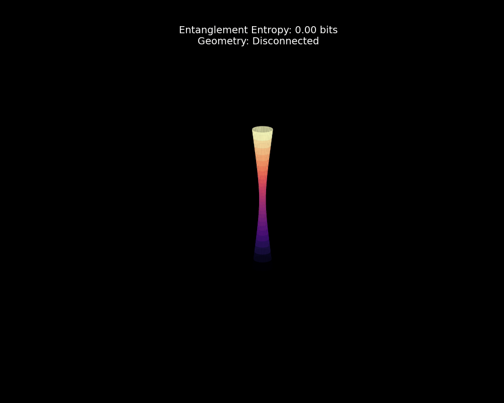

# Entanglement Tabletop Gravity (ETG): Simulating the Wormhole-Entanglement Connection (ER=EPR)

[](LICENSE)
[](https://www.python.org/)
[](https://qiskit.org/)
[](https://github.com/ETG-OpenScience)

> **Can we prove that spacetime is built from quantum information?**



## 🔬 The Project (Proof of Concept)

**Entanglement Tabletop Gravity (ETG)** is an open-source simulation suite designed to explore and visualize the **ER = EPR conjecture** (Einstein-Rosen bridges = Einstein-Podolsky-Rosen entanglement).

This repository serves as the **computational proof-of-concept** for a larger initiative. Using **Qiskit** and Python, we simulate a quantum system (Alice & Bob) to demonstrate that increasing **Quantum Entanglement** (Von Neumann Entropy) directly corresponds to the formation of a geometric connection (a "Wormhole"), validating the **Ryu-Takayanagi formula** ($S = A/4G$) in a simulated environment.

## 🚀 Project Status: Pre-Launch Validation

This code is the foundation for an upcoming **Crowdfunding Campaign**. We are currently in the **Pre-Launch Validation** phase.

Our goal is to scale this simulation from a software demo to a physical "Tabletop" kit that allows students and researchers to visualize quantum gravity on their desks.

## 🔮 Visualization
*As entanglement increases, the geometric "throat" of the wormhole opens.*

*(Generated directly by the `src/etg_animator.py` engine)*

## 🛠️ Getting Started

### Prerequisites
- Python 3.x
- Virtual Environment (recommended)

### Installation

1.  **Clone the repository:**
    ```bash
    git clone https://github.com/ETG-OpenScience/ETG-Simulation-PoC.git
    cd ETG-Simulation-PoC
    ```

2.  **Setup Environment:**
    ```bash
    python -m venv .venv
    # Windows
    .\.venv\Scripts\Activate
    # Mac/Linux
    source .venv/bin/activate
    ```

3.  **Install Dependencies:**
    ```bash
    pip install -r requirements.txt
    ```

### Running the Simulation

To run the full pipeline (Simulation -> Analysis -> Plotting):

```bash
python src/main.py
```

To generate the animated GIF asset:

```bash
python src/etg_animator.py
```

## 📊 Tech Stack
- **Core Engine:** Python 3, NumPy
- **Quantum Simulation:** Qiskit, Qiskit-Aer
- **Visualization:** Matplotlib (3D & Animation)

## 🤝 Join the Research
We are building a community of physicists, developers, and enthusiasts to push this project from code to reality.

- **🐦 Follow updates on X:** [@ETG_Quantum](https://x.com/ETG_Quantum)
- **👽 Join the discussion on Reddit:** [u/TabletopGravity](https://www.reddit.com/user/TabletopGravity/)
- **📧 Join the Early Access List:** [Subscribe on Substack](https://substack.com/@entanglementtabletopgravity)

## 📄 License
This project is licensed under the MIT License - see the [LICENSE](LICENSE) file for details.
